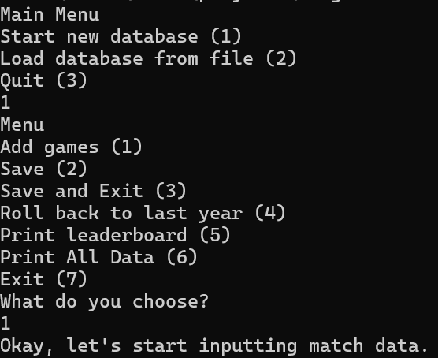
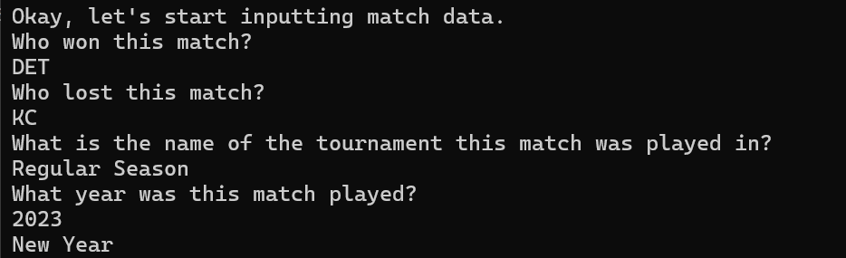
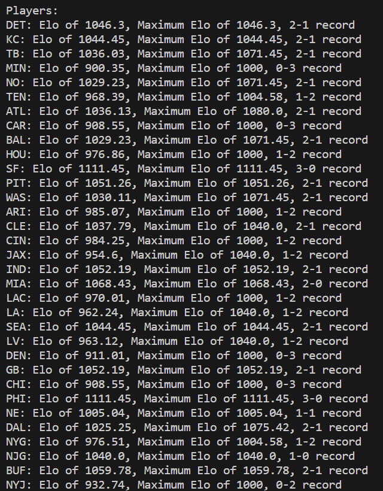
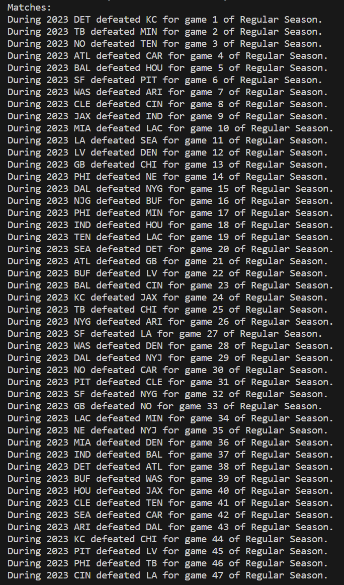
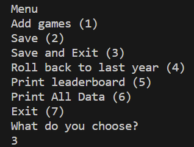
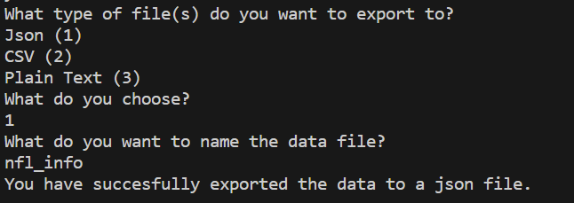
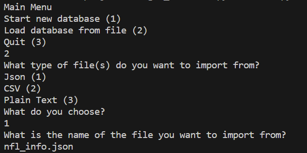

# Elo Leaderboard
## Overview
This program is a continually updating leaderboard for sports leagues. All the user has to do enter in a matches result, players, date, and tournament and the database is updated. The database consists of a list of players and a list of matches. Each match has a date, tournament, match number, and result. Each player has a name, a win loss record, and an [elo rating](https://en.wikipedia.org/wiki/Elo_rating_system). Leaderboards can be saved by being exported to a file and imported in at a later point. Users can fix errors by reverting to the leaderboard of a past year. 
## How to Use
Create a leaderboard for a sports league by adding in match statistics. To update the leaderboard add matches. To check that the leaderboard is correct print the data. The settings allow you to change the way you input data and how the system responds to said data. Once you are done adding matches export the leaderboard to text, csv, or json. Any exported leaderboard can be imported back into the program to be updated.
## Example

Let's create a leaderboard for the NFL. We'll start by adding matches. 

Once we've added some matches we can check whether our data is correct by printing a console output.

 

If we're satisfied then we can export it to a file. 

Now, the next time we start the program we can load in the old database. 

